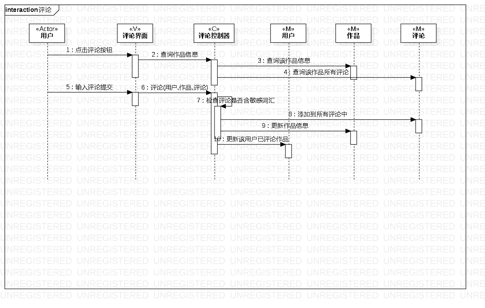
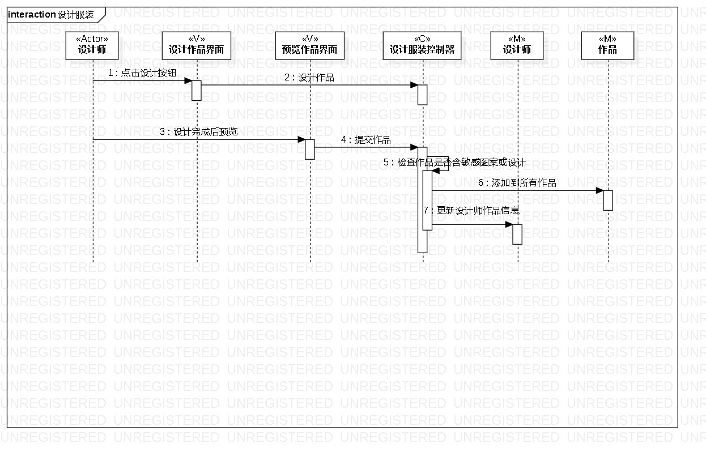

# 实验六：相互作用建模  

## 一、实验目标  
1、理解系统互动；  
2、掌握UML顺序图的画法；  
3、掌握对象互动的定义与建模方法。  

## 二、实验内容
1、根据用例模型和类模型，确定功能所涉及的系统对象；  
2、在顺序图上画出参与者（对象）；  
3、在顺序图上画出消息（交互）。  

## 三、实验步骤
1、确定用例收藏涉及的对象：用户（Actor）、收藏界面（V）、收藏控制器（C）、用户（M）、收藏夹（M）；  
2、确定用例评论涉及的对象：用户（Actor）、评论界面（V）、评论控制器（C）、用户（M）、作品（M）、评论（M）；  
3、确定用例设计服装涉及的对象：设计师（Actor）、设计作品界面（V）、预览作品界面（V）、设计服装控制器（C）、设计师（M）、作品（M）；  
4、确定每个用例各对象之间的消息交互；  
5、画出顺序图  

## 四、实验结果
1、收藏用例的顺序图  
  

2、评论用例的顺序图  
  

3、设计服装用例的顺序图  

