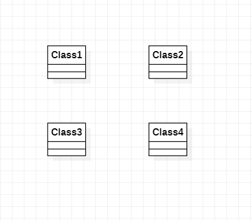

#实验一

##实验目标
1.安装并使用StarUML；
2.温习git操作；

##实验内容
1.安装建模工具StarUML并创建第一张图；
2.在Markdown中显示图片；

##实验步骤
1.安装git与StarUML；
2.fork主库后clone分支到本地文件夹；
3.创建markdown文档；
4.使用StarUML建立一张UML图并导出；
5.使用git bash上传文档和图到远程仓库；
6.在github中编辑使图片显示到lab1.md文档中；
7.Create new pull request；

##实验结果

