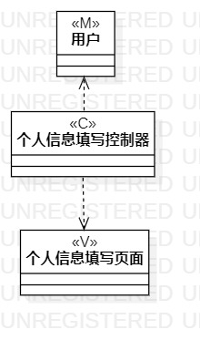
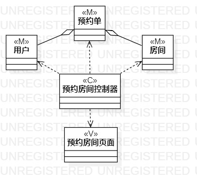

# 实验目标
1.掌握类建模方法；

2.学习MVC中每个字母的含义；

3.理解类之间的各种关系；

4.掌握类图的画法；（Class Diagram）

# 实验内容
1.基于MVC模式设计填写个人信息类和预约房间类；

2.设计类的关系；

3.画出类图；

# 实验步骤
1.回看实验三过程建模图和实验二用例规约图，提取用例中的类；

2.在starUML中画出所有类；

3.将各类用对应关系连接线连接；

4.调整类图；

5.将类图和文档上传到远程仓库；

#实验结果

1.填写个人信息类图

2.预约房间类图

