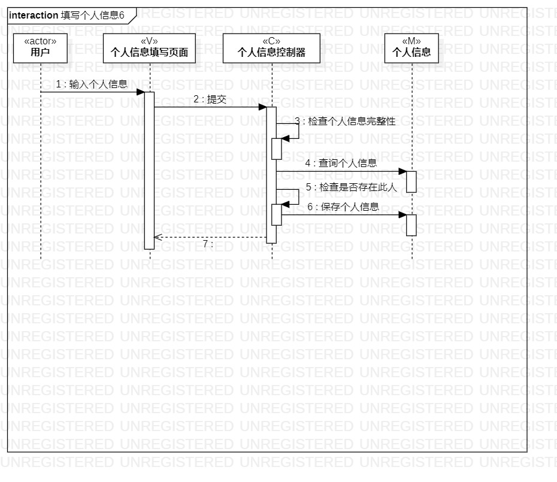
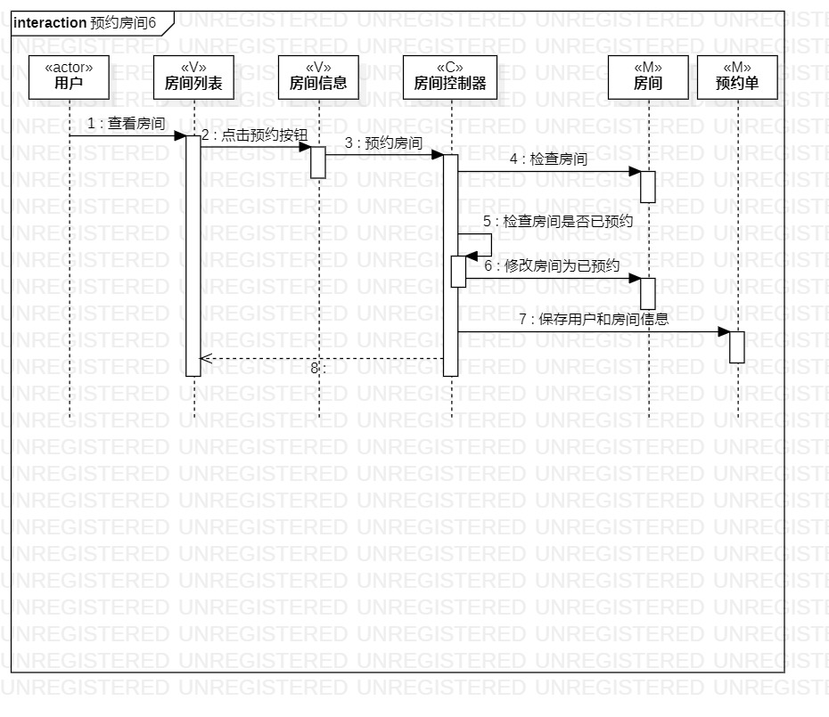

# 实验目标

1.学习系统的交互；

2.学习对象的交互方式；

3.掌握UML交互图的画法；

# 实验内容

1.根据用例和类模型确定交互建模的参与者；

2.制定交互对象和交互内容；

3.在顺序图上画出对象并定义它们的交互内容；

# 实验步骤

1.在startUML创建新的sequence diagram；

2.先画出所有参与者；

3.根据前面实验的建模定义各对象间的关系；

4.修改实验二预约房间用例、实验三两用例图排版；

# 实验结果

填写个人信息类交互图

预约房间类交互图
