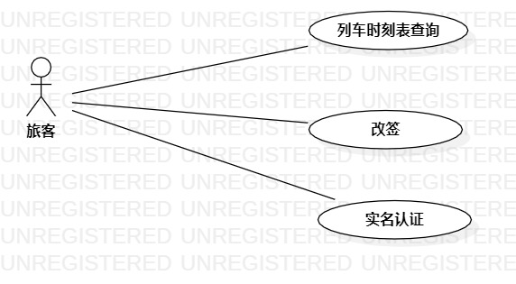

# 实验二：用例建模

## 一、实验目标
1、完成选题 \
2、学会starUML用例建模 \
3、学会用markdown编写实验文档，写出用例规约

## 二、实验内容
1、完成选题 \
2、对自己的选题用starUML进行用例建模 \
3、用markdown编写实验文档，写出用例规约

## 三、实验步骤
> 1、确定选题（铁路票务系统） 

> 2、选题功能：
> + 列车时刻表查询
> + 改签
> + 实名认证

> 3、根据系统功能确认角色和事件及彼此之间的联系，用StarUML画出用例图并检查
> + 一个角色：旅客
> + 三个用例：列车时刻表查询、改签、实名认证

> 4、建立联系绘制用例图（model2）

> 5、写出用例规约

## 4.实验结果

  
图2.用例建模

## 表1：列车时刻表查询用例规约

用例编号  | UC01 | 备注  
-|:-|-  
用例名称  | 列车时刻表查询 |  
前置条件  | 旅客进入票务系统 | *可选* |  
后置条件  |  查询到相应车次时刻表  | *可选* |  
基本流程  | 1、旅客点击列车时刻表查询链接； | *用例执行成功的步骤* |  
~| 2、系统显示需要输入列车车次信息； |  
~| 3、旅客输入所要查询的列车车次，点击查询按钮； |  
~| 4、系统查询旅客输入车次时刻表； |  
~| 5、系统显示列车时刻表。 |  
扩展流程  | 4.1系统未查询到旅客所输入车次信息，提示旅客您所查询车次暂无信息。 | *用例执行失败* |    

## 表2：改签用例规约

用例编号  | UC02 | 备注  
-|:-|- 
用例名称  | 改签 |  
前置条件  | 旅客进入票务系统 | *可选*  
后置条件  | 改签成功 | *可选*  
基本流程  | 1、旅客选择自己想要改签的订单； | *用例执行成功的步骤*  
~| 2、旅客点击改签按钮;  
~| 3、系统显示选择想要改签日期;  
~| 4、旅客选择想要改签的日期；  
~| 5、系统显示可提供改签的当日车次信息；  
~| 6、旅客选择想要改签的车次；  
~| 7、系统询问旅客是否确认改签；  
~| 8、旅客选择确认改签;  
~| 9、系统跳转到支付页面，提示旅客支付手续费;  
~| 10、旅客支付手续费;  
~| 11、系统确认支付结果;  
~| 12、系统记录交易信息;  
~| 13、系统显示改签成功。    
扩展流程  | 5.1 系统查询到当日已无车次可改签，提示旅客“您所选择的日期无可改签车次" | *用例执行失败*  
~| 10.1 旅客支付失败，提示旅客"支付失败，请再十分钟内支付您的订单"    
~| 11.1 系统确认支付结果失败，提示旅客“订单支付失败，请在十分钟内支付您的订单”

## 表3：实名认证用例规约

用例编号  | UC03 | 备注  
-|:-|-  
用例名称  | 实名认证 |  
前置条件  | 旅客进入票务系统 | *可选*  
后置条件  | 实名认证成功 | *可选*  
基本流程  | 1、旅客实名认证按钮； |*用例执行成功的步骤*  
~| 2、系统提示旅客输入需要购票的旅客身份信息；  
~| 3、旅客输入身份信息；  
~| 4、系统核对旅客输入的身份信息是否正确；  
~| 5、系统显示实名认证成功页面。  
扩展流程  | 4.1 系统核实到旅客输入的身份信息有误，提示旅客“您输入的身份信息有误，请重新输入” | *用例执行失败*  

