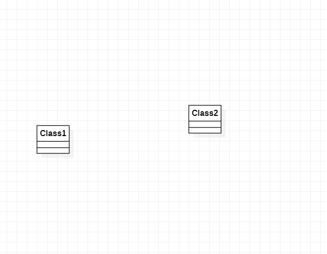

# 实验一：UML建模工具

## 实验目标

1. 熟悉Github实验过程
2. 安装与使用StartUML

## 实验内容

1. 安装Github并练习使用Git Bash
2. 安装StartUML并创建一个图

## 实验步骤

1. 安装Git软件与StarUML软件
2. fork项目
3. 将项目clone到本地
4. 在本地项目中创建以自己学号命名的文件夹
5. 在StarUML绘制第一张UML图，并以jpg格式导出图。
6. 将图片提交到Github，（git add,commit,push）。
7. 在实验报告中使用图，完成实验报告。

## 实验结果
1.画图  
   
图1.在StartUML上创建的第一个图
