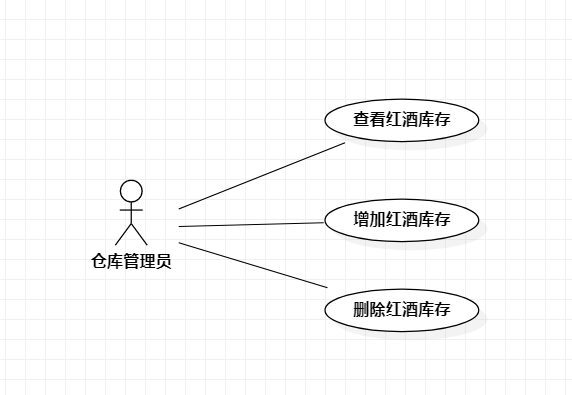

# 实验二：用例建模

## 1.实验目的

1. 使用Markdown编写报告
2. 细化选题
3. 学习使用StarUML用例建模

## 二、 实验内容  

1. 创建用例图
2. 编写实验报告文档
3. 编写用例规约

## 三、 实验步骤  

1. issues选题为红酒仓库管理系统
2. 根据选题在StarUML上创建用例图
3. 添加1个参与者  
   - 仓库管理员
4. 添加3个用例
   - 查看红酒库存
   - 增加红酒库存
   - 删除红酒库存
5. 用线建立参与者与用例之间的联系
6. 完成用例图并提交
7. 复制用例规约模板并编写用例规约

## 四、 实验结果  

1. 画图  
  
图1:红酒仓库管理系统的用例图

## 表1：查看红酒库存用例规约  

用例编号  | UC01 | 备注  
-|:-|-  
用例名称  | 查看红酒库存  |   
前置条件  |  仓库管理员登录进入红酒仓库管理系统   | *可选*   
后置条件  | 红酒库存页面     | *可选*   
基本流程  | 1. 仓库管理员点击查看按钮；  |*用例执行成功的步骤*    
~| 2. 系统显示红酒库存查看页面；  |   
~| 3. 仓库管理员输入红酒名称，点击查看按钮；  |   
~| 4. 系统查询红酒仓库信息，检查存在的红酒库存，显示该红酒库存页面；  |   
扩展流程  | 4.1 系统检查发现该红酒名称不存在，提示仓库管理员“该红酒不存在”。 |*用例执行失败*    

## 表2：增加红酒库存用例规约  

用例编号  | UC02 | 备注  
-|:-|-  
用例名称  | 增加红酒库存  |   
前置条件  |  仓库管理员登录进入红酒仓库管理系统   | *可选*   
后置条件  | 红酒库存增加成功页面     | *可选*   
基本流程  | 1. 仓库管理员点击增加按钮；  |*用例执行成功的步骤*    
~| 2. 系统显示红酒库存增加页面；  |   
~| 3. 仓库管理员输入新增红酒名字、数量、价格、度数信息，点击确定按钮；  |   
~| 4. 系统查询规定格式信息，检查输入内容与规定格式信息匹配，保存新增红酒信息；  |   
~| 5. 系统显示红酒库存增加成功页面；  |   
扩展流程  | 4.1 系统检查发现输入内容与规定格式信息不匹配，提示仓库管理员“请输入正确格式信息”。 |*用例执行失败*   

## 表3：删除红酒库存用例规约  

用例编号  | UC03 | 备注  
-|:-|-  
用例名称  | 删除红酒库存  |   
前置条件  |  仓库管理员登录进入红酒仓库管理系统   | *可选*   
后置条件  | 红酒库存删除成功页面     | *可选*   
基本流程  | 1. 仓库管理员点击删除按钮；  |*用例执行成功的步骤*    
~| 2. 系统显示红酒库存删除页面；  |   
~| 3. 仓库管理员输入红酒名称，点击删除按钮；  |   
~| 4. 系统查询红酒仓库信息，检查存在的红酒库存，删除该红酒相关信息；  |  
~| 5. 系统显示红酒库存删除成功页面；  |   
扩展流程  | 4.1 系统检查发现该红酒名称不存在，提示仓库管理员“该红酒不存在”。 |*用例执行失败*    
