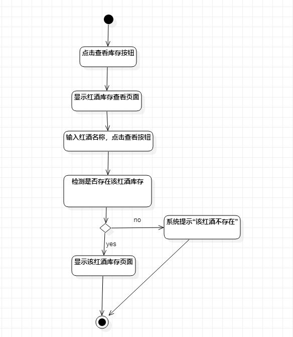
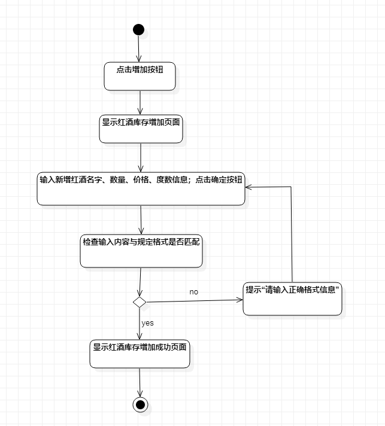
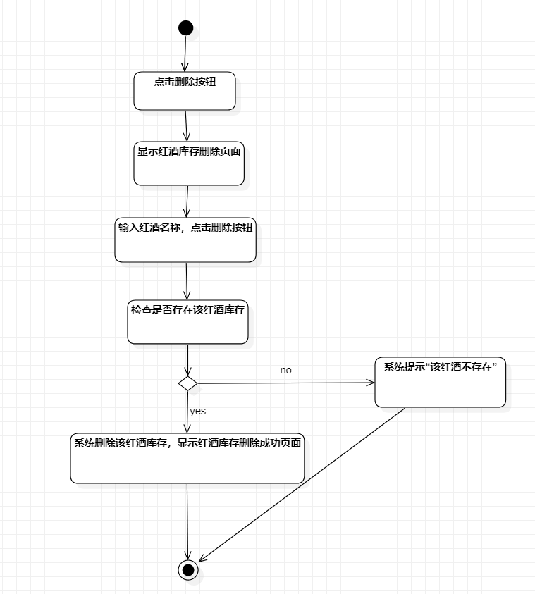

# 实验三：过程建模

## 1. 实验目标

- 掌握过程建模方法
- 掌握活动图的画法

## 2. 实验内容

- 利用StarUML画出活动图
- 熟悉活动图符号的用法和意义
- 编写实验报告

## 3. 实验步骤

1.打开StarUML创建活动图  
2.查看上周实验完成的用例规约  
3.根据查看红酒库存用例规约画出用例的活动图  
4.根据增加红酒库存用例规约画出用例的活动图  
5.根据删除红酒库存用例规约画出用例的活动图  
6.编写实验报告  

## 4. 实验结果

图1：查看红酒库存的活动图

图2：增加红酒库存的活动图

图3：删除红酒库存的活动图
