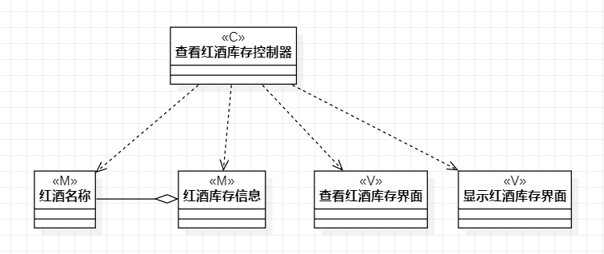
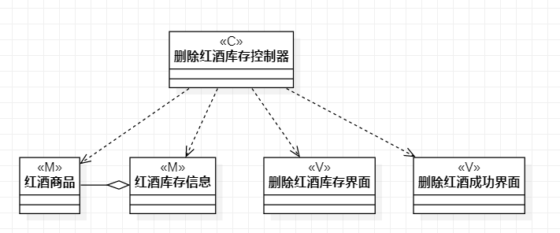

# 实验四:类建模
# 实验五:高级类建模

## 一、实验目标
1. 掌握类的概念
2. 掌握类建模方法
3. 了解MVC设计模式
4. 理解类的5种关系

## 二、实验内容
1. 基于MVC模式设计类    
2. 设计类的关系  
3. 画出类图  

## 三、实验步骤
1. 根据用例规约找出类以及视图和控制器
2. 根据MVC模式确定类之间的关系
3. 用正确的线将类与视图和控制器连接
4. 用StarUML工具绘图
5. 完成实验报告

## 四、实验结果
  
图1：查看红酒库存类图

  
图2：增加红酒库存类图

  
图3：删除红酒库存类图
