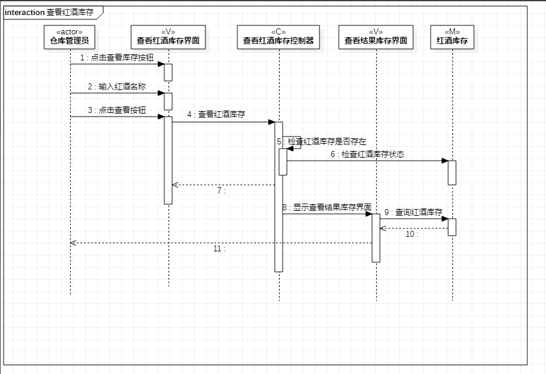
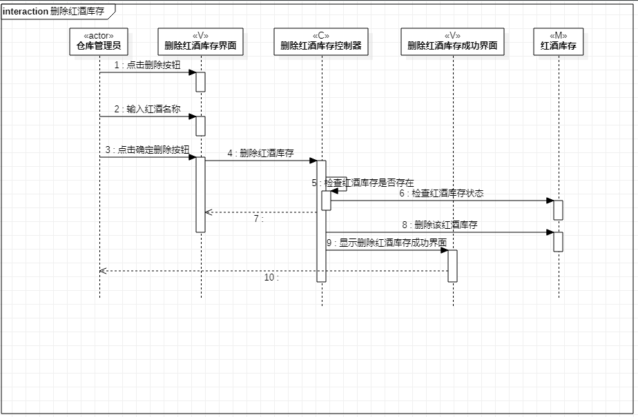

# 实验6：交互建模

## 一、实验目标

1. 掌握交互建模方法。

2. 掌握顺序图的画法。（Sequence Diagram）

## 二、实验内容

1. 根据用例规约图、活动图、用例图、类图创建顺序图

## 三、实验步骤

1. 修改实验四、五类图。  
2. 根据实验四、五类图确定Lifeline  
3. 根据实验二、三确定消息，并添加message  
4. 添加reply message
5. 完成实验六及其实验报告

## 四、实验结果

   
图1：查看红酒库存顺序图

  
图2：增加红酒库存顺序图

  
图3：增加红酒库存顺序图
