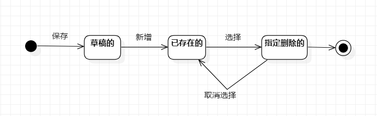

# 实验七：状态建模

 ## 一、实验目标

 1. 掌握状态图及其画法（状态图，Statechart）

 ## 二、实验内容

1. 找到1个重要的对象；
2. 寻找这个对象的所有关键状态；
3. 画出状态之间的转换条件。

 ## 三、实验步骤

1. 找到关键的对象--红酒库存  
2. 找到该对象的关键状态  
   草稿的、已添加的、已删除的
3. 找出状态转变条件
4. 绘制状态图

 ## 四、实验结果

 

 **图1：红酒库存的状态图**
