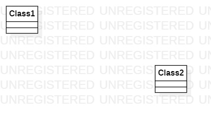

# 实验一

## 一、实验目标

1、下载并安装建模工具 StarUML；

2、确定个人建模选题，将选题填写在 Issues 中。

## 二、实验内容

## 三、实验步骤

1、下载StarUML和Git

2、注册git账号

3、确认选题及其功能要求

4、建立第一个UML模型图

5、使用git上传本地使用文件

6、在GitHub上将git上的文件发送至老师账号

## 四、选题标题：图书馆座位管理系统

功能需求：

功能1：添加座位信息

功能2：预约座位
