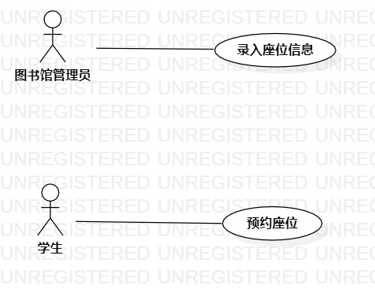

# 实验二

## 一、实验目标
1. 创建并完善建模选题
2. 学会使用StarUML绘制用例图

## 二、实验内容
1. 建立个人选题项目
2. 根据自己的项目运用UMLStar绘制用例图
3. 用git操作提交本次实验

## 三、实验步骤
1.确立系统（图书馆座位管理系统）的功能(UseCase)
 - 添加座位信息
 - 预约座位

2.根据功能建立Use Case
 确立系统的扮演者（Actor）
 - 图书馆管理员
 - 学生
 
3.建立之间的联系（Association）
 
## 四、实验结果

图1.图书馆座位管理系统的用例图

# 用例规约的编写

## 表1：添加座位信息用例1规约  

用例编号  | UC01 | 备注  
-|:-|-  
用例名称  | 添加座位信息  |   
前置条件  |   图书馆管理员进入添加页面   | *可选*   
后置条件  |      | *可选*   
基本流程  | 1.图书馆管理员输入座位编号和状态（空闲、使用中以及已预约三者中选其一），点击添加按钮；；  |*用例执行成功的步骤*    
~| 2.系统检查到座位信息填写完整；  |
~| 3.系统查询座位信息，检查到座位信息不重复，保存添加的座位信息；  |
~| 4.系统显示“添加成功”。   |     
扩展流程  | 2.1 系统检查到座位信息未填写完整，提示“座位信息未填写完整”；  |*用例执行失败*    
~| 3.1 系统检查到座位信息重复，提示“添加失败，该座位信息已存在”。  |  

## 表2：预约座位用例2规约  

用例编号  | UC02 | 备注  
-|:-|-  
用例名称  | 预约座位  |   
前置条件  |   学生进入预约座位页面   | *可选*   
后置条件  | 学生进入预约成功页面    | *可选*   
基本流程  | 1.学生输入学号和姓名，并选择预约的时间段和座位，点击预约按钮；  |*用例执行成功的步骤*    
~| 2.系统查询学生信息，检查到预约者账号存在；  |   
~| 3.系统查询预约信息，检查到预约时间段内的空闲座位数量不为0；  |  
~| 4.系统查询座位信息，检查到预约座位的状态为空闲；  |
~| 5.系统修改预约座位的状态为已预约，将预约信息保存到预约单；   |   
~| 6.系统显示“预约成功”。   |
扩展流程  | 2.1系统查询学生信息，检查到预约者账号不存在，提示“账号不存在，预约失败”；   |*用例执行失败*
~| 3.1系统查询预约信息，检查到预约时间段内的空闲座位数量为0，提示“该时间段内没有可预约的座位”；  |
~| 4.1系统查询座位信息，检查到预约座位的状态为使用中或者已预约，提示“该座位已被预约或使用中”。  |
 
