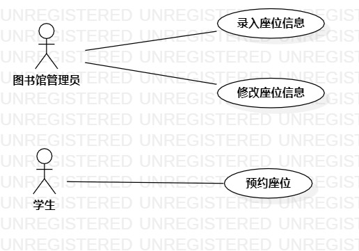

# 实验二

## 一、实验目标
1. 创建并完善建模选题
2. 学会使用StarUML绘制用例图

## 二、实验内容
1. 建立个人选题项目
2. 根据自己的项目运用UMLStar绘制用例图
3. 用git操作提交本次实验

## 三、实验步骤
1.确立系统（图书馆座位管理系统）的功能(UseCase)
 - 录入座位信息
 - 修改座位信息
 - 预约座位

2.根据功能建立Use Case
 确立系统的扮演者（Actor）
 - 图书馆管理员
 - 学生
 
3.建立之间的联系（Association）
 
## 四、实验结果

图1.图书馆座位管理系统的用例图

# 用例规约的编写

## 表1：录入座位信息用例1规约  

用例编号  | UC01 | 备注  
-|:-|-  
用例名称  | 录入座位信息  |   
前置条件  |      | *可选*   
后置条件  |      | *可选*   
基本流程  | 1.图书馆管理员点击录入按钮；  |*用例执行成功的步骤*    
~| 2.系统显示录入页面；  |   
~| 3.图书馆管理员输入座位编号和状态（空闲、使用中以及已预约三者中选其一），点击提交按钮；   |   
~| 4.系统检测座位信息完整并且不重复，保存录入的座位信息；   |   
~| 5.系统显示“录入成功”。   |  
扩展流程  | 4.1 系统检测到座位信息未填写完整，提示“座位信息未填写完整”；  |*用例执行失败*    
~| 4.2 系统检测到座位信息重复，提示“该座位信息已存在”。  |  

## 表2：修改座位信息用例2规约  

用例编号  | UC02 | 备注  
-|:-|-  
用例名称  | 修改座位信息  |   
前置条件  |      | *可选*   
后置条件  |      | *可选*   
基本流程  | 1.图书馆管理员点击修改按钮；  |*用例执行成功的步骤*    
~| 2.系统显示修改页面；  |   
~| 3.图书馆管理员修改座位信息，点击提交按钮；   |   
~| 4.系统检测修改的座位信息不重复，保存修改的座位信息；   |   
~| 5.系统显示“修改成功”。   |  
扩展流程  | 4.1 系统检测到修改的座位信息重复，提示“修改失败，该座位信息已存在”。  |*用例执行失败*    

## 表3：预约座位用例3规约  

用例编号  | UC03 | 备注  
-|:-|-  
用例名称  | 预约座位  |   
前置条件  |      | *可选*   
后置条件  | 学生进入预约成功页面    | *可选*   
基本流程  | 1.学生点击预约座位按钮；  |*用例执行成功的步骤*    
~| 2.系统显示预约座位页面；  |   
~| 3.学生输入学号、姓名以及预约的时间段，点击提交按钮；   |   
~| 4.系统检测该时间段的空闲座位数量不为0，显示空闲座位；   |   
~| 5.学生选择其中一个座位并点击确定按钮；   |
~| 6.系统显示“预约成功”；   |
扩展流程  | 4.1 系统检测该时间段的空闲座位数量为0，提示“没有可预约的座位”。  |*用例执行失败*    
 
