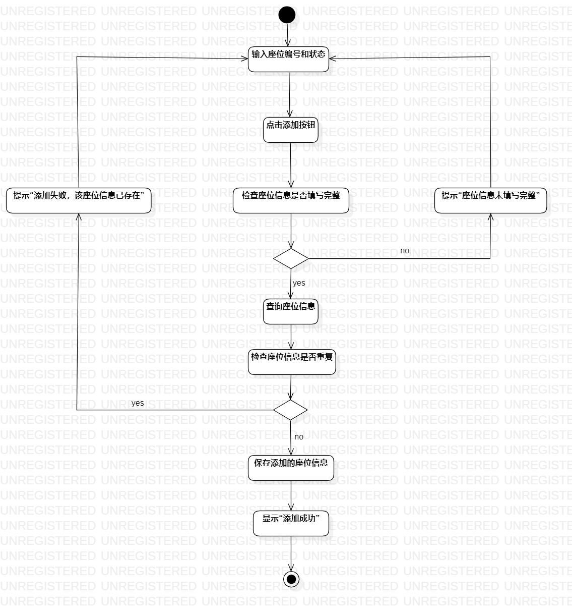
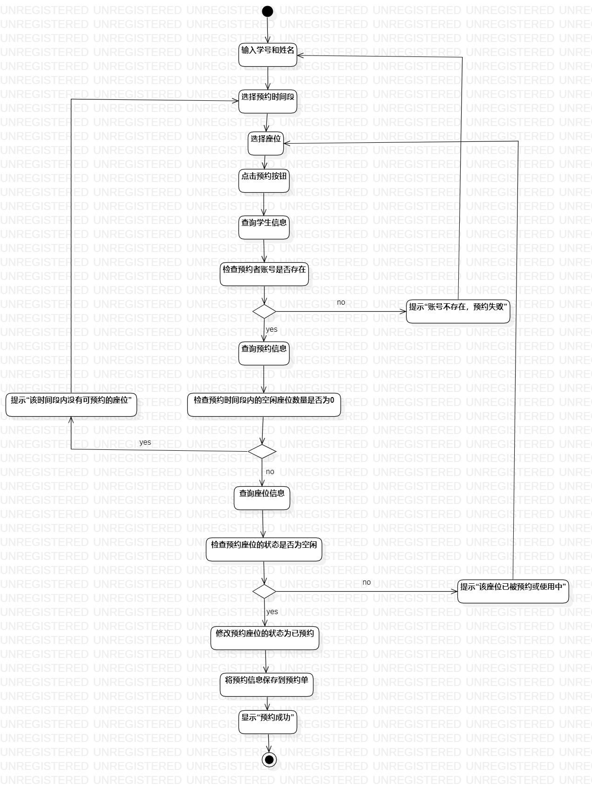

# 实验三:过程建模

## 一、实验目标
- 学习并掌握过程建模的基本概念。
- 绘制活动图（Activity Diagram）。
## 二、实验内容

- 根据用例规约绘制相应的活动图。

## 三、实验步骤
1、在StarUML中创建活动图；

（1）添加座位信息；

（2）预约座位。

2、添加Initial和Final节点；

3、根据用例规约绘制绘制活动图。

（1）把基本流程和扩展流程的动作画为操作（Action）；

（2）分支的操作之后使用决策（Decision）节点。

## 四、实验结果

   
图1 添加座位信息活动

  
图2 预约座位活动图
