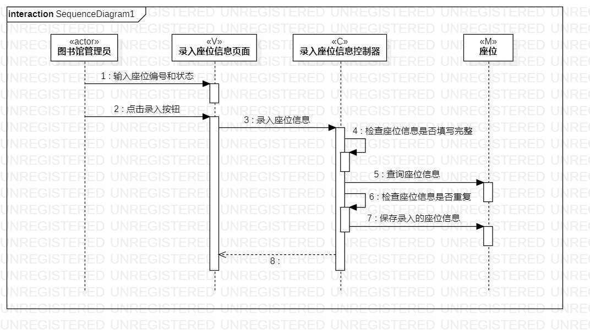
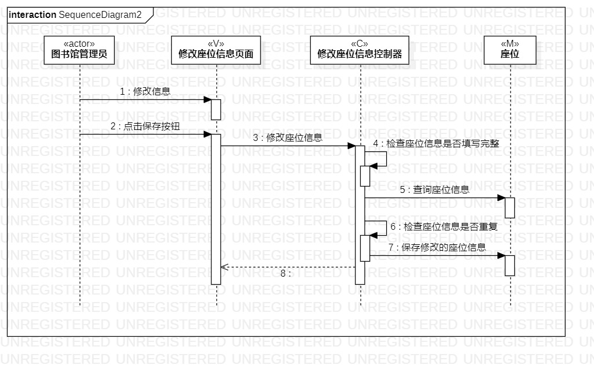

# 实验六：交互建模

## 一、实验目标

1. 理解系统交互；
2. 掌握UML顺序图的画法；
3. 掌握对象交互的定义与建模方法。

## 二、实验内容

1. 根据用例模型和类模型，确定功能所涉及的系统对象；
2. 在顺序图上画出参与者（对象）；
3. 在顺序图上画出消息（交互）。

## 三、实验步骤

1. 根据根据实验二的用例图和实验四、五的类图，确定功能所涉及的系统对象
2. 打开StarUML model新建Sequence diagram
3. StarUML画顺序图
   - 按对象添加Lifeline
   - 按活动图添加Message
   - 建立Reply Message
   
4. 导出绘制好的顺序图
5. git push到个人库
6. 写lab6.md

## 四、实验结果

   
图1：添加座位信息顺序图

   
图2：预约座位顺序图
