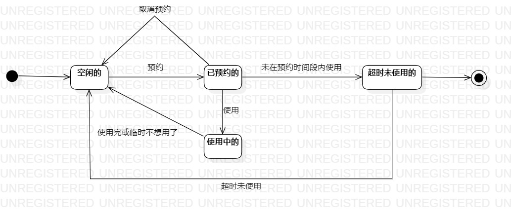

# 实验七：状态建模

## 一、实验目标

1. 理解何为对象的状态；
2. 掌握状态建模方法；
3. 掌握状态图的画法（Statechart Diagram）。

## 二、实验内容

1. 学习对象的状态的概念；
2. 学习状态图的画法；
3. 找出自己系统中的一个关键对象，绘制该对象的状态图。

## 三、实验步骤

1. 从本系统（图书馆座位管理系统）中找出一个关键对象，即座位；
2. 设计座位的关键状态：
   - 空闲的
   - 已预约的
   - 使用中的
   - 超时未使用的

3. 设计上述四种状态之间的转变条件；
4. 用StarUML画出该对象的状态图（StatechartDiagram）
   - Add - Statechart

## 四、实验结果

   
图1：座位的状态图

