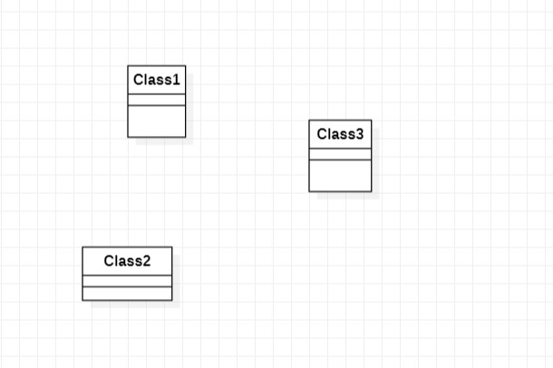

# 实验一

## 一、实验目标

1.学习使用GIthub完成实验  
2.安装学习使用StartUML  

## 二、实验内容

1.练习使用Git Bash的操作  
2.安装StartUML并创建图  

## 三、实验步骤

1.加入GitHub库  
2.使用Git Bash clone UML实验库  
3.安装StartUML  
4.使用StartUML创建图  
5.保存图为jpg格式到本地库  
6.使用Git Bash上传图到自己的库中  
7.修改实验文档  
8.提交实验到hzuapps库中  

## 四、实验结果

  
图1.在StartUML上创建的第一个图
