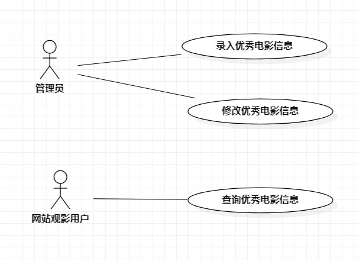

# 实验二：用例建模

## 一、实验目标
- 学习使用Markdown完善实验报告  
- 明确选题内容  
- 学习使用StarUML用例建模  
- 学习用例规约 
## 二、实验内容

- 完善实验报告  
- 分析用例，创建用例图  
- 编写实验报告  
- 编写用例规约  

## 三、实验步骤

- 完善实验一文档lab1.md中实验目标、实验内容、实验步骤和实验结果  
- 修改Issues题目为：优秀影视推荐系统 内容为：1.录入优秀电影信息2.修改优秀电影信息3.查询优秀电影信息  
- 确定参与者：
    - 信息录入员  
    - 观影用户  
- 确定用例：
    - 录入优秀电影信息  
    - 修改优秀电影信息  
    - 查询优秀电影信息    
- 链接参与者和用例    
- 画出用例图  
- 编写用例规约  
## 四、实验结果

  
图1.优秀影视推荐系统用例图  

## 表1：录入优秀电影信息用例规约  

用例编号  | UC01 | 备注  
-|:-|-  
用例名称  | 录入优秀电影信息   |   
前置条件  | 信息录入员登录进入优秀影视推荐系统   | *可选*   
后置条件  | 信息录入员进入电影录入界面     | *可选*   
基本流程  | 1. 信息录入员主点击电影录入按钮；  |*用例执行成功的步骤*    
~| 2. 系统显示电影录入页面；  |   
~| 3. 信息录入员录入电影名、填写其他电影信息，点击录入按钮；  |   
~| 4. 系统查询电影名，检查不存在相同电影，保存电影信息；  |   
~| 5. 系统显示电影信息页面。  |  
扩展流程  | 4.1 系统检查发现电影已经存在，提示信息录入员“电影已存在优秀电影推荐库中”。 |*用例执行失败*    

## 表2：修改优秀电影信息用例规约  

用例编号  | UC02 | 备注  
-|:-|-  
用例名称  | 修改优秀电影信息  |   
前置条件  | 信息录入员进入电影录入界面   | *可选*   
后置条件  |    | *可选*   
基本流程  | 1. 信息录入员点击需更改信息的电影链接；  |*用例执行成功的步骤*    
~| 2. 系统显示电影信息修改页面；  |   
~| 3. 信息录入员修改电影信息，点击保存按钮；  |   
~| 4. 系统查询电影信息，检查未存在相同电影信息，保存电影信息；  |   
~| 5. 系统显示电影信息页面。  |  
扩展流程  | 4.1 系统检查发现当前修改与未修改前信息相同，提示信息录入员“此次修改信息不变”。  |*用例执行失败*    

## 表3：查询优秀电影信息用例规约

用例编号  | UC03 | 备注  
-|:-|-  
用例名称  | 查询优秀电影信息  |   
前置条件  | 观影用户进入电影推荐页面   | *可选*   
后置条件  |     | *可选*   
基本流程  | 1.观影用户点击查询链接 ；  |*用例执行成功的步骤*    
~| 2. 系统显示查询页面；  |   
~| 3. 观影用户输入需要查询的电影名，点击查询按钮；  |   
~| 4. 系统检查电影名不为空，查询电影名；|
~| 5. 系统显示电影信息页面。|
扩展流程  | 系统检查电影名为空，提示“电影名不能为空”。  |*用例执行失败* 
