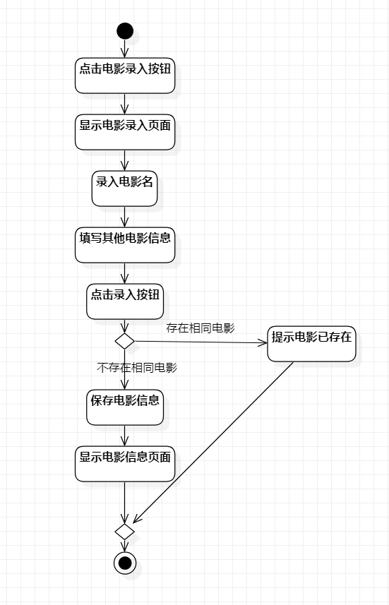
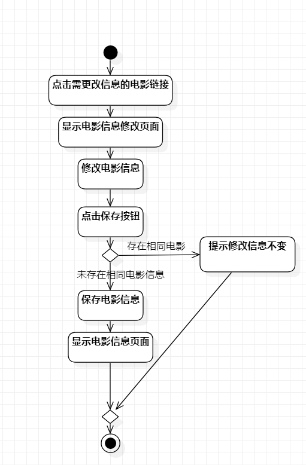
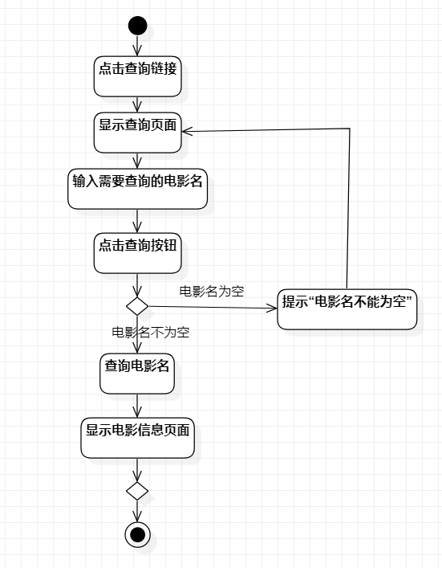

# 实验三：过程建模

## 一、实验目标

1.学会过程建模；

2.学会画活动图。

## 二、实验内容

1.由用例规约画出活动图；

2.编写实验三实验报告。

##  三、实验步骤

1.在新建的活动图中添加开始（Initial）和结束结点（Final）；

2.根据之前的用例规约添加活动（action）； 
 
3.添加决策节点(Decision)和合并节点(Merge)；  

4.用控制流线(Control flow)连接各部分； 

5.依照同样操作画出剩余两张图。  

## 四、实验结果

图1：录入优秀电影活动图

图2：修改优秀电影活动图

图3：查询优秀电影活动图
