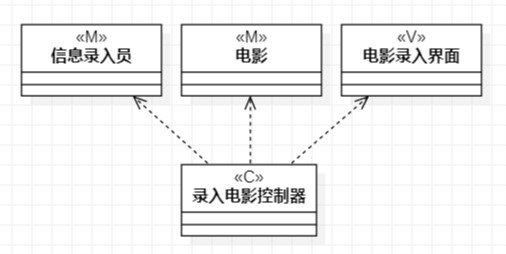
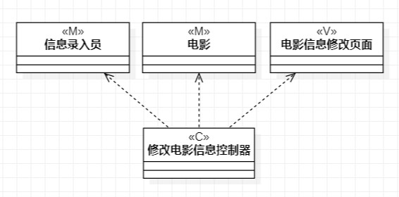
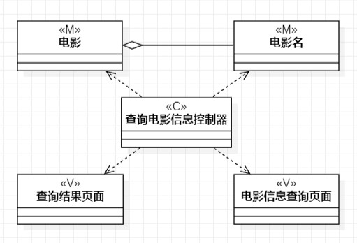

# 实验四:类建模
# 实验五:高级类建模

## 一、实验目标
- 学会类的概念
- 学会类的5种关系
- 学会类之间关系的画法
- 学会类的建模
## 二、实验内容
- 依据实验二用例规约画出类图。

   1.录入优秀电影类图

   2.修改优秀电影类图

   3.查询优秀电影类图
## 三、实验步骤
- 分别开始创建类图
  1.录入优秀电影
  2.修改优秀电影
  3.查询优秀电影
- 在用例规约中的找出类
- 根据MVC设计模式决定好关系并连线
## 四、实验结果

图1 录入优秀电影类图

图2 修改优秀电影类图

图3 查询优秀电影类图
