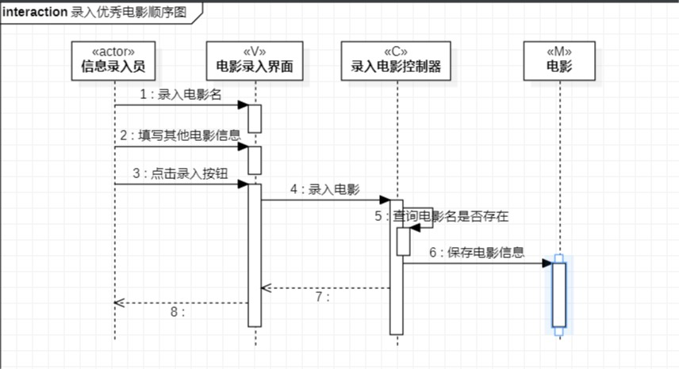
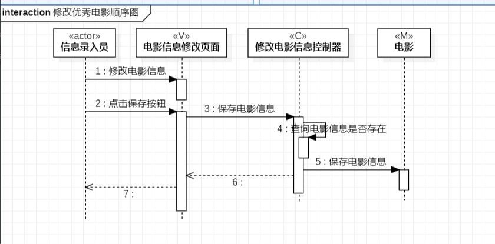
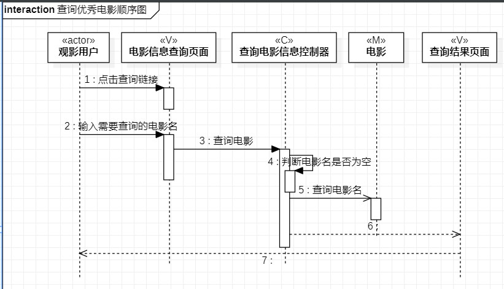

# 实验六：交互建模

## 一、实验目标

1. 理解系统交互
2. 掌握UML顺序图的画法
3. 掌握对象交互的定义与建模方法

## 二、实验内容

1. 根据用例模型和类模型，确定功能所涉及的系统对象
2. 在顺序图上画出参与者（对象）
3. 在顺序图上画出消息（交互）

## 三、实验步骤

1. 理解系统交互并学习顺序图的画法
2. 创建录入优秀电影的顺序图
3. 根据用例规约，查找actor，
4. 根据类图，添加参与者
5. 根据活动图中的操作流程，画出对象之间的相互作用；
6. 根据同样以上步骤画出修改优秀电影和查询优秀电影顺序图
7. 完成实验六实验报告

## 四、实验结果

  
图1：录入优秀电影顺序图

  
图2：修改优秀电影的顺序图

  
图2：查询优秀电影的顺序图
