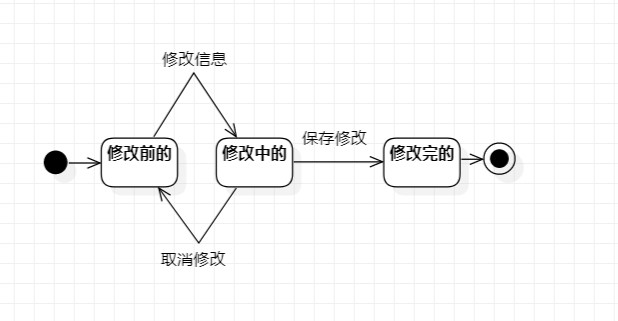

# 实验七：状态建模

## 一、实验目标

1. 掌握对象状态建模（状态图，Statechart）

## 二、实验内容

- 寻找一个关键的对象；
- 设计该对象的关键状态；
- 设计该对象的转变条件。

## 三、实验步骤

1. 选择在修改电影信息中的电影作为关键的对象；

2. 画出电影两个的状态(已发布的和已下架的);  
 
3. 链接三个状态  

4. 编写实验七报告 

## 四、实验结果

图1. 电影状态图

