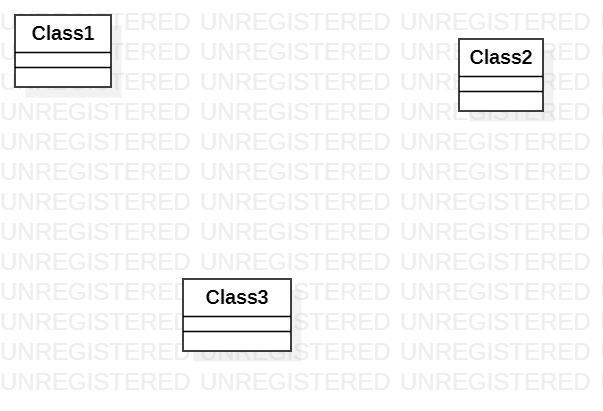

# 实验一

## 一、实验目标

1. 熟悉Github实验过程
2. 安装与使用StartUML

## 二、实验内容

1. 安装Github并练习使用Git Bash
2. 安装StartUML并创建一个图

## 三、实验步骤

1. 安装Git软件
2. 将项目库fork入我的GitHub库
3. 绘制简单的UML图
4. 根据实验创建实验报告

## 四、实验结果
1. 画图

  
图1. 在StartUML上创建的第一个图
