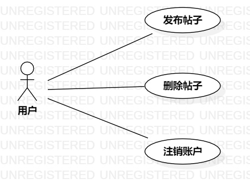

# 实验二

## 一、实验目标

1. 掌握用例建模知识
2. 使用StartUML绘制用例图

## 二、实验内容

1. 确定issues选题
2. 根据选题绘制用例图
3. 根据用例图编写用例规约

## 三、实验步骤

1. 确定issues选题：树洞talk系统
2. 根据选题确定参与者：用户
3. 根据选题确定用例：
  - 发布帖子
  - 删除帖子
  - 注销账户
4. 根据参与者与用例之间的关系，绘制用例图（图1）
5. 根据用例图，编写用例规约

## 四、实验结果
1. 画图  
  
  
图1. 树洞talk系统用例图  
  
2. 用例规约  

## 表1：发布帖子用例规约  

用例编号  | UC01 | 备注  
-|:-|-  
用例名称  | 发布帖子  |   
前置条件  |   用户登陆系统   | *可选*   
后置条件  |   用户点击"发布帖子"按钮   | *可选*   
基本流程  | 1. 用户进入发布界面；  |*用例执行成功的步骤*    
~| 2. 用户点击"发布"按钮；  |   
~| 3. 系统检测无违法违规内容，保存帖子，提示发布成功；  |   
~| 4. 系统显示首页界面。  |   
扩展流程  | 4.1 系统检测有违法违规内容，将帖子存进草稿箱，提示发布失败。  |*用例执行失败*    

## 表2：删除帖子用例规约  

用例编号  | UC02 | 备注  
-|:-|-  
用例名称  | 删除帖子  |   
前置条件  |   用户登陆系统   | *可选*   
后置条件  |   用户进入已发布帖子界面   | *可选*   
基本流程  | 1. 用户点击进入目标帖子专属界面；  |*用例执行成功的步骤*    
~| 2. 用户点击"删除"按钮；  |   
~| 3. 系统检查帖子编号存在，执行删除操作，提示删除成功；  |   
~| 4. 系统显示已发布帖子界面。  |   
扩展流程  | 3.1 系统检查帖子编号不存在，提示删除失败；  |*用例执行失败*      
~| 4.1 系统显示目标帖子专属界面。  |  

## 表3：注销账户用例规约  

用例编号  | UC03 | 备注  
-|:-|-  
用例名称  | 注销账户  |   
前置条件  |   用户登陆系统   | *可选*   
后置条件  |   用户进入个人信息界面   | *可选*   
基本流程  | 1. 用户点击"注销账户"按钮；  |*用例执行成功的步骤*    
~| 2. 系统检测用户登录状态正常，清空任务栈；  |   
~| 3. 系统显示登陆界面。  |     
扩展流程  | 2.1 系统检测用户登录状态不正常，提示注销失败；  |*用例执行失败*    
~| 3.1 系统显示个人信息界面。  |  
