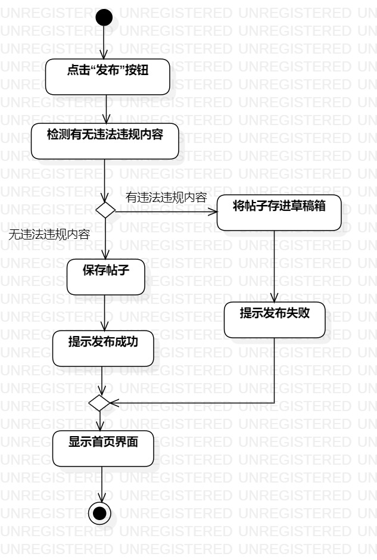
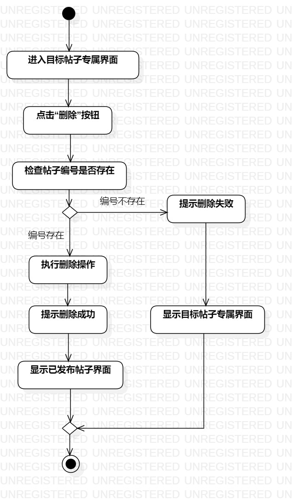
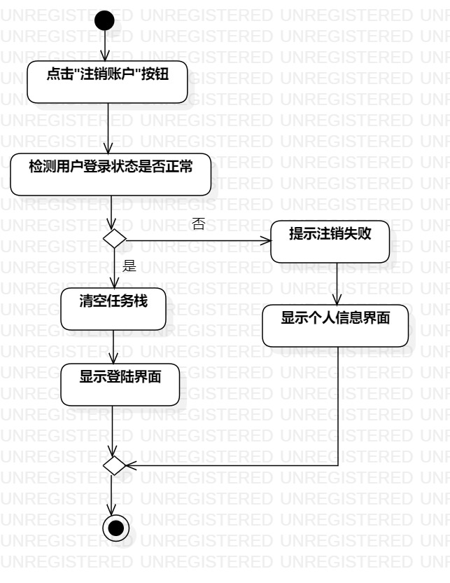

# 实验三

## 一、实验目标

1. 掌握过程建模知识
2. 根据用例规约绘制过程图

## 二、实验内容

1. 观看教学视频，学习过程建模知识
2. 根据实验二的用例规约，绘制用例的过程图

## 三、实验步骤

1. 使用哔哩哔哩网站，观看和学习过程建模知识
2. 根据实验2的用例和用例规约绘制用例过程图
	- 过程的开始和结束需标明
	- 活动使用圆角矩形绘制
	- 活动的决策结果需要分支说明
	- 分支最后需要合并
3. 编写实验报告

## 四、实验结果
1. 画图  

  
图1. 发布帖子的过程图  
  
  
图2. 删除帖子的过程图  
  
  
图3. 注销账户的过程图
