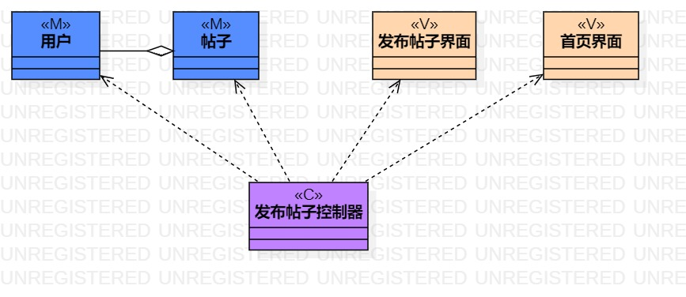
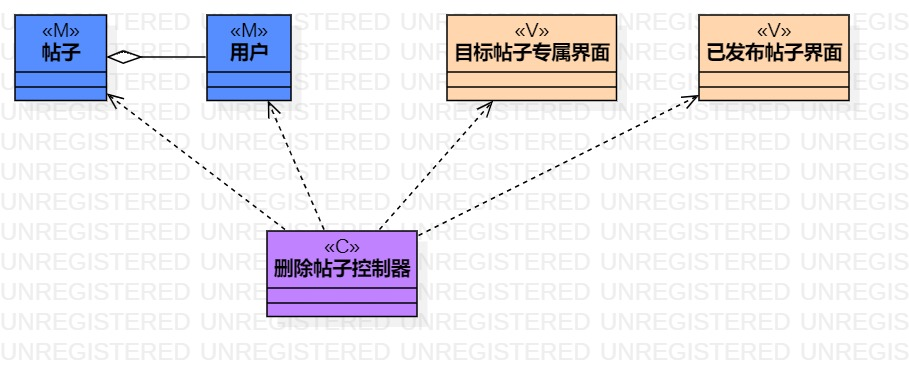
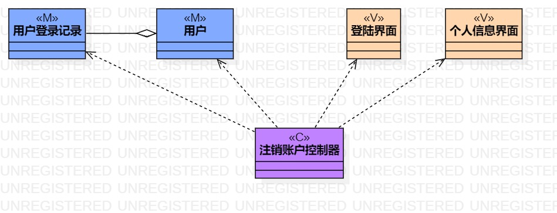

# 实验四、五

## 一、实验目标

1. 掌握类建模方法
2. 了解MVC设计模式
3. 理解类的5种关系
4. 掌握类图(Class Diagram)的画法

## 二、实验内容

1. 观看教学视频，学习类建模知识
2. 基于MVC模式设计类
3. 设计类的关系
4. 根据类的关系画出类图

## 三、实验步骤

1. 使用哔哩哔哩网站，观看和学习类建模知识
2. 从用例规约中的基本流程和扩展流程中寻找类
3. 根据 发布帖子 的用例规约设计：
	- M：帖子的编号的内容（帖子类）、用户的账号和密码（用户类）
	- V：发布帖子的界面、展示帖子的首页界面
	- C：发布帖子的控制器
4. 根据 删除帖子 的用例规约设计：
	- M：帖子的编号的内容（帖子类）、用户的账号和密码（用户类）
	- V：删除的目标帖子的界面、展示已发布的所有帖子的界面
	- C：删除帖子的控制器
5. 根据 注销账户 的用例规约设计：
	- M：用户的账号和密码（用户类）、用户的登陆状态和时间等记录（用户登陆记录类）
	- V：个人信息的界面、登录的界面
	- C：注销账户的控制器

## 四、实验结果
1. 画图  

  
图1. 发布帖子的类图  
  
  
图2. 删除帖子的类图  
  
  
图3. 注销账户的类图
