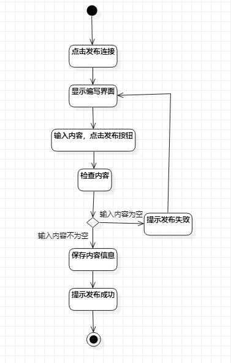
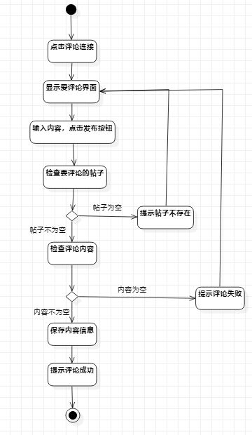

# 实验三：过程建模
## 一、实验目标
1.掌握过程建模的方法；  
2.掌握活动图的画法。
## 二、实验内容
1.观看指定的学习视频；  
2.根据实验二的用例规约画出活动图。
## 三、实验步骤
1.根据实验二用例规约创建相应的活动图（lab3_send.JPG、lab3_comment.JPG）;  
2.添加起始和结束节点；  
3.根据实验二的发布帖子和评论帖子的用例规约添加相应的操作；  
4.添加决策点，连线；  
5.撰写实验三文档。
## 四、实验结果
  
图1：发布帖子的活动图  
  
图2：评论帖子的活动图  
