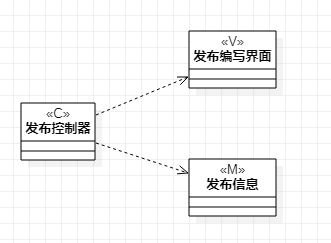
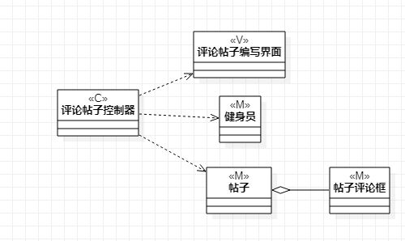

# 实验四五：类建模
## 一、实验目标 
1. 掌握类建模方法
2. 了解MVC或你熟悉的设计模式
3. 掌握类图的画法（Class Diagram）
## 二.实验内容
 - 根据实验二中的用例规约进行画类图
  1. 选择用例的类图
  2. 提交订单用例的类图
  3. 处理订单用例的类图
## 三、实验步骤
1. 新建类图（Add Diagram -> Class Diagram）
2. 画出各个用例用到的类（Model、View、Controller）
3. 用线连接各个类表示它们之间的关系
    - 依赖Dependency（虚线箭头）
    - 关联Association（实线）
    - 聚合Aggregation（实线空心棱形）
    - 组合Composition（实线实心棱形）
    - 继承Inheritance（实线空心三角形）
## 四、实验结果
  
图1：发布帖子用例的类图  

  
图2：评论帖子用例的类图  
