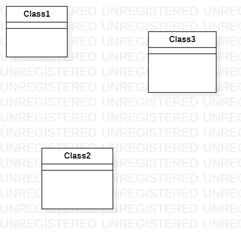

# 实验一：UML建模工具

## 1.实验目标

- 熟悉github的使用
- 安装和学习StarUML的基础使用

## 2.实验内容

- 熟悉使用github提交作业
- 安装并学习StarUML的使用

## 3.实验步骤

- 下载并安装git工具还有StarUML软件
- 在github上fork老师的项目到自己的账号下
- clone项目到本机
- 在本地文件夹中建一个自己学号命名的文件夹
- 创建实验一文档Markdown文档，并用StarUML创建一张UML图
- 将UML图插入到实验一Markdown文档中
- 用git上传文件夹到自己fork的项目下
- 在github上使用pull request请求合并到主库

## 4.实验结果

