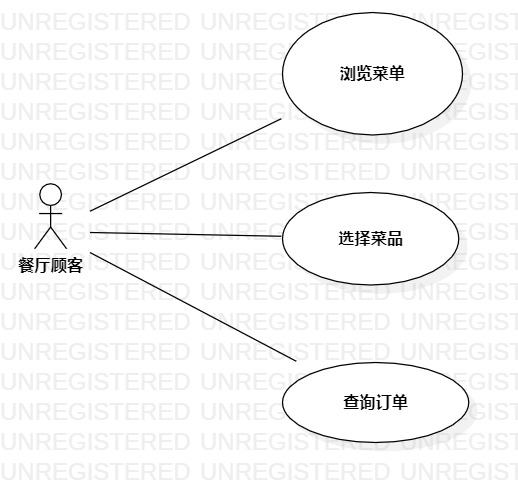

# 实验二：用例建模

## 1.实验目标

- 理解用例的概念
- 掌握用例建模
- 学习用例规约写法

## 2.实验内容

- 细化功能需求
- 画出用例图（Use Case Diagram)
- 编写用例规约（表格）

## 3.实验步骤

- 创建一个名为餐厅顾客的角色
- 创建三个实例，分别为点菜，预定餐桌
- 用直线连接餐厅顾客和两个用例
- 写出点菜和预定餐桌两个用例规约

## 4.实验结果

 
 
 图1.客户点菜预约程序的用例图

## 表1：点菜用例规约  

用例编号  | 01 | 备注  
-|:-|-  
用例名称  | 点菜  |   
前置条件  |   餐厅顾客进入浏览菜单界面   | *可选*   
后置条件  |      | *可选*   
基本流程  | 1.餐厅顾客输入餐桌号  |*用例执行成功的步骤*    
~| 2.餐厅顾客点击想要菜品后的+号，再点击提交按钮 | 
~| 3.系统查询订单中菜品剩余数量  | 
~| 4.系统验证订单中菜品剩余数量大于餐厅顾客下单菜品数量  |  
~| 5.系统保存订单信息，提示【已下单，单号:xx】  |   
扩展流程  | 4.1 系统验证订单中菜品剩余数量小于订单中菜品数量，提示【xx菜品后厨剩余数量不足，下单失败】  |*用例执行失败*    

## 表2：预定餐桌用例规约  

用例编号  | 02 | 备注  
-|:-|-  
用例名称  | 预定餐桌  |   
前置条件  |   餐厅顾客进入预定餐桌界面   | *可选*   
后置条件  |      | *可选*   
基本流程  | 1.餐厅顾客输入姓名，手机号，时间，人数，点击预定按钮  |*用例执行成功的步骤*      
~| 2.系统匹配到餐桌数据，记录餐厅顾客预定数据  |   
~| 3.系统提示【预定成功】  | 
扩展流程  | 2.1系统匹配不到合适的餐桌数据，提示【桌位已满】   |*用例执行失败*    

