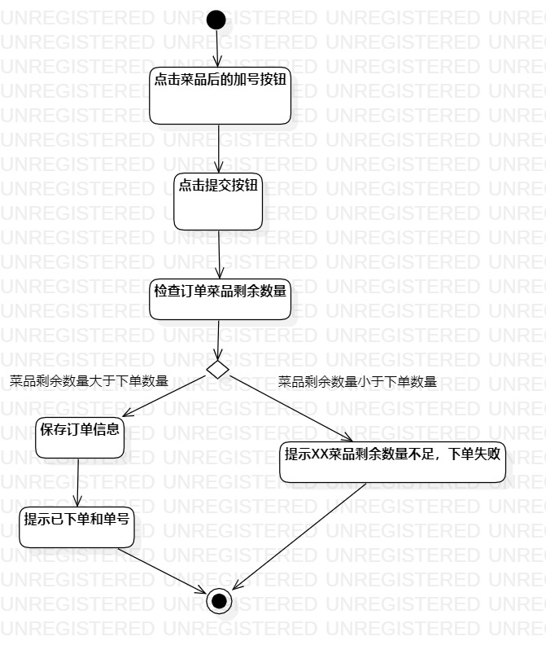
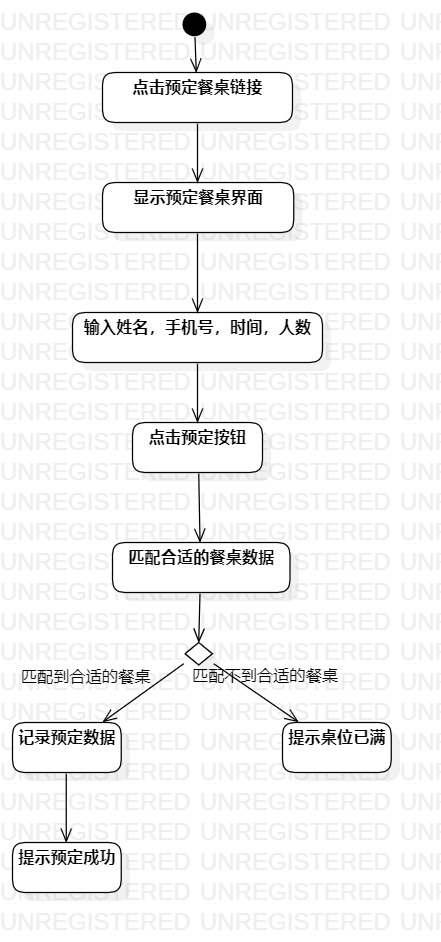

# 实验三：过程建模

## 1.实验目标

- 掌握过程建模方法；
- 掌握活动图的画法。（Activity Diagram）

## 2.实验内容

- 根据自己的选题设计活动与操作；
- 根据自己的选题画出活动图。

## 3.实验步骤

- 创建一个Initial的起点图标
- 根据点菜用例规约的基本流程使用Action
-使用Decision标示扩展流程
-最后使用Final图标表示结束

## 4。实验结果
   
  
  图1.点菜过程图

   
 
  图2.预定餐桌过程图
