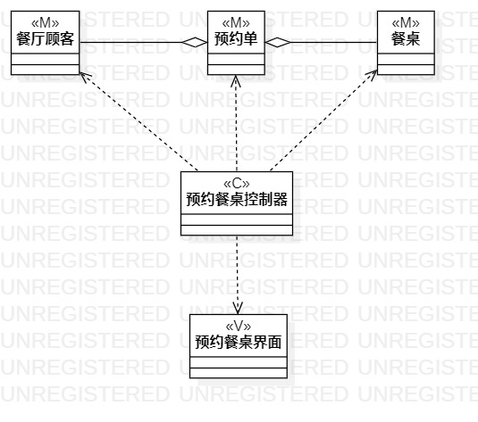

# 实验四：类建模

## 1.实验目标

- 掌握类建模
- 了解MVC或你熟悉的设计模式
- 掌握类图的画法（Class Diagram)

## 2.实验内容

- 基于MVC模式设计类
- 设计类的关系
- 画出类图

## 3.实验步骤

- 创建一个Initial的起点图标
- 根据点菜用例规约的基本流程使用Action
-使用Decision标示扩展流程
-最后使用Final图标表示结束

## 4。实验结果
   
  
  图1.点菜类图

   
 
  图2.预约餐桌类图