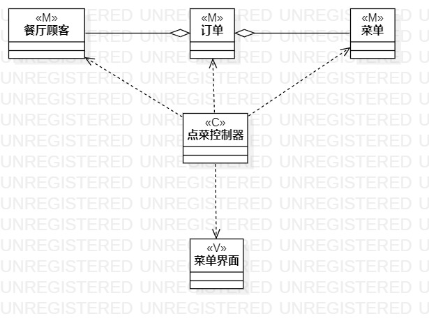
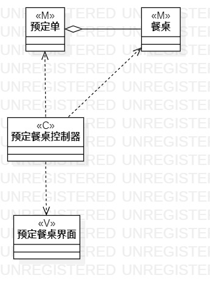

# 实验四：类建模

## 1.实验目标

- 掌握类建模
- 了解MVC或你熟悉的设计模式
- 掌握类图的画法（Class Diagram)

## 2.实验内容

- 基于MVC模式设计类
- 设计类的关系
- 画出类图

## 3.实验步骤

- 创建点菜的类图项目
- 创建点菜控制器类图，菜单类图，订单类图，菜单界面类图
- 用依赖线连接点菜控制器类图和其他的类图，使用聚合线连接餐厅顾客类，订单类图和菜单类图
- 创建预约餐桌类图项目
- 创建预约餐桌控制器类图，餐桌类图，预约单类图，预约餐桌界面类图
- 用依赖线连接预约餐桌控制器类图和其他类图，使用聚合线连接预约单类图和餐桌类图

## 4。实验结果
   
  
  图1.点菜类图

   
 
  图2.预约餐桌类图
