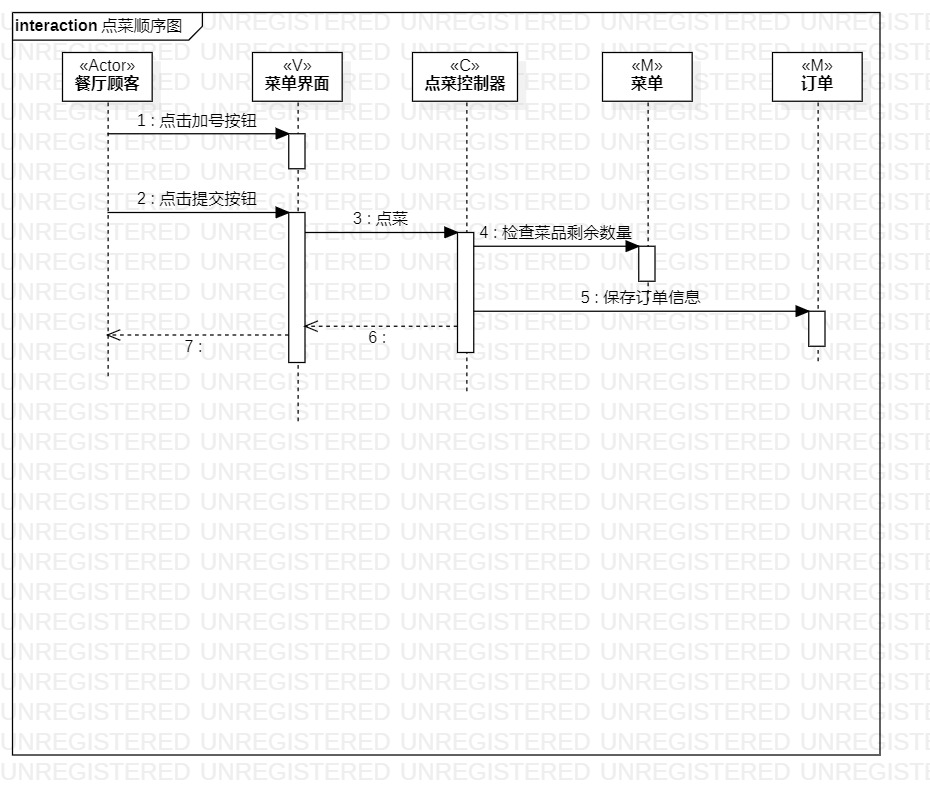
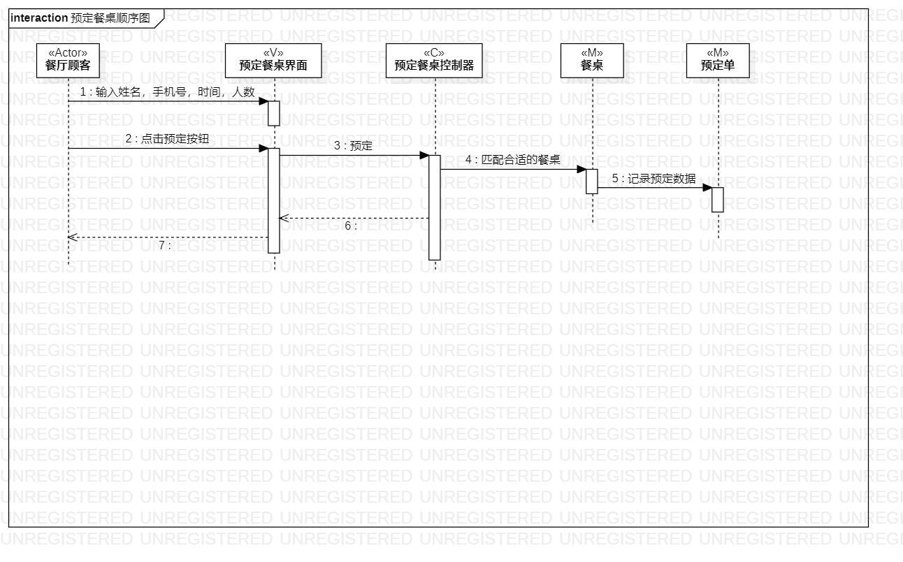

# 实验六：交互建模

## 1.实验目标

- 理解系统交互
- 掌握UML顺序图的画法
- 掌握对象交互的定义与建模方法

## 2.实验内容

- 根据用例建模和类模型，确定功能所涉及的系统对象
- 在顺序图上画出参与者（对象）
- 在顺序图上画出消息（交互）

## 3.实验步骤

- 参考之前实验做的用例规约还有过程图，理清思路
- 创建n+1个参与者
- 画出参与者之间的交互

## 4。实验结果
   
  
  图1.点菜交互图

   
 
  图2.预约餐桌交互图
