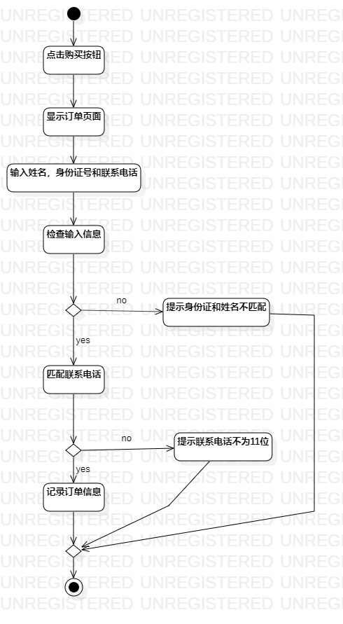

# 实验三：过程建模

## 一，实验目标

1.掌握过程建模的方法

2.掌握活动图的画法

## 二，实验内容

1.根据用例规约画活动图

## 三，实验步骤

1.根据实验二的用例规约，在StarUML中创建“提交订单”，“支付费用”两个活动图

2.通过对齐，自动调整大小等操作调整活动图的布局

## 四，实验结果

 ### 提交订单活动图

 

### 支付费用活动图

 

