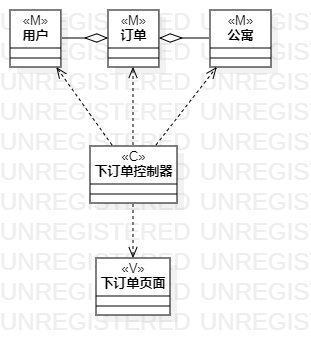
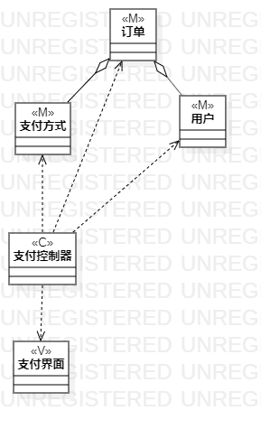

# 实验四五：类建模

## 1. 实验目标

1. 了解类图概念
2. 了解MVC模式
3. 掌握类图画法
4. 了解UML类图的5种关系
5. 掌握类建模方法

## 2. 实验内容

1. 学习类图概念
   - 类与类
   - 类与关系
2. 学习类图画法
3. 画用例类图

## 3. 实验步骤

1. 根据MVC模式观察用例
2. 打开StarUML
3. 用StarUML画类图
4. 编写实验报告

## 4. 实验结果

图1：提交订单类图

图2：支付费用类图