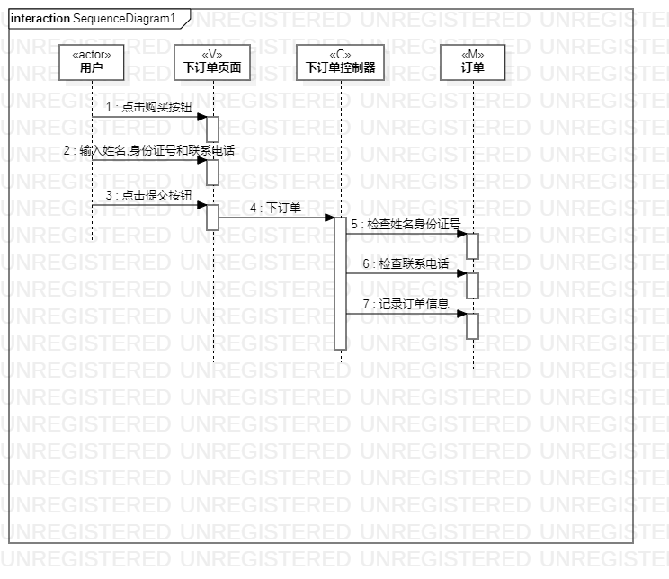
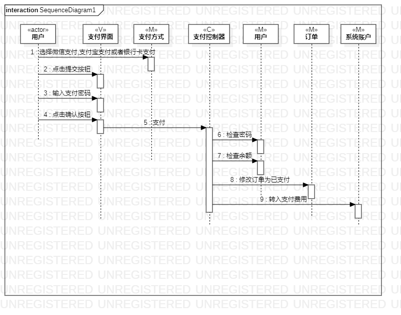

# 实验六：交互建模

## 一、实验目标

1.理解系统互动的概念。

2.掌握UML顺序图的画法。

3.掌握对象交互的定义与建模方法。

## 二、实验内容

1.根据活动图和类图，确定功能所涉及的系统对象。  

2.在顺序图上画出参与者。  

3.在顺序图上画出消息。

## 三、实验步骤

1.观看视频学习顺序图的知识
  
2.在画顺序图时，参考之前的用例规约，用例图以及类图，需要时作出修改
  
3.画“提交订单”顺序图
   
4.画“支付费用”顺序图  

## 四、实验结果

图1：提交订单顺序图 

图2：支付费用顺序图 
