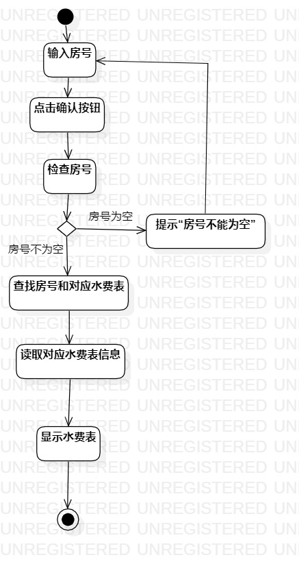
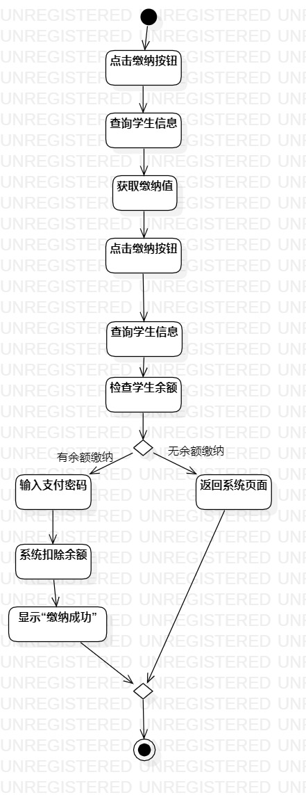

# 实验三

## 一. 实验目标
1. 掌握过程建模方法；
2. 掌握活动图的画法。（Activity Diagram）

## 二. 实验内容
1. 使用StarUML根据lab2中编写的用例规约画活动图

## 三. 实验步骤
1. 新建活动图
2. 使用Activities中的元素绘制用例活动图
3. 将绘制的活动图导出为.jpg图片
4. 编写实验报告
5. pull本地磁盘文件和Push到自己GitHub仓库中

## 四. 实验结果    

  
图1：查询水费的活动图

  
图2：充值余额的活动图

  
图3：缴纳水费的活动图