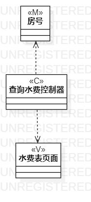
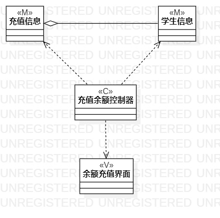
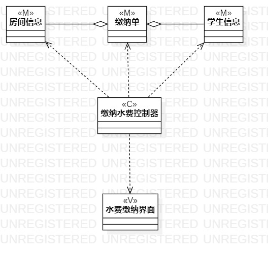

# 实验四五：类建模

## 一、实验目标  
1. 掌握类建模方法
2. 了解MVC或你熟悉的设计模式  
3. 掌握类图的画法（Class Diagram）
## 二、实验内容
1. 根据用例规约绘制相应的类图
## 三、实验步骤
1. 新建类图
2. 画出各个用例用到的类
3. 用线连接各个类表示它们之间的关系
4. 将绘制的活动图导出为.jpg图片
5. 编写实验报告
6. pull本地磁盘文件和Push到自己GitHub仓库中
## 四、实验结果
   
 图1：查询水费用例的类图  

   
 图2：充值余额用例的类图  

   
 图3：缴纳水费用例的类图  