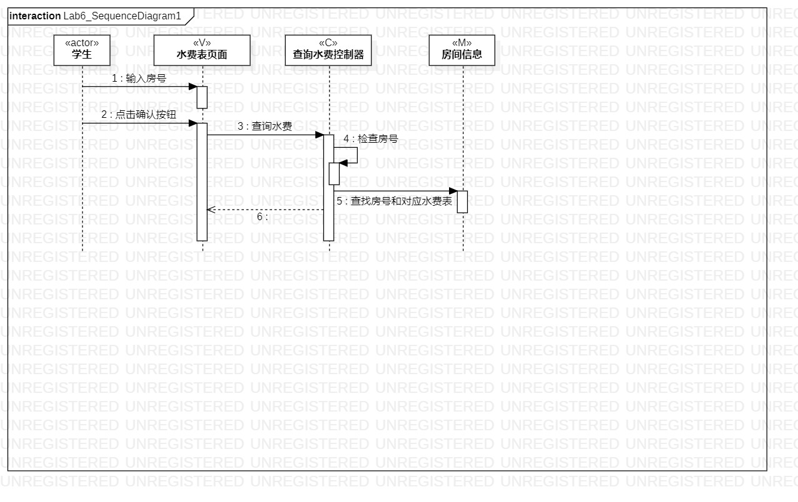
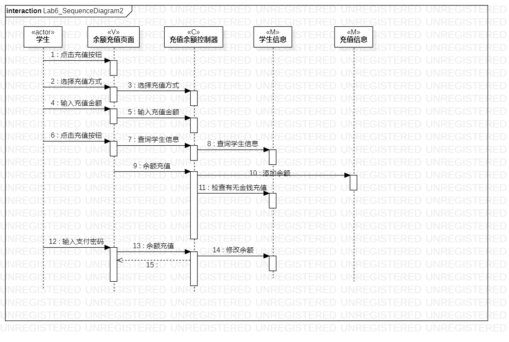
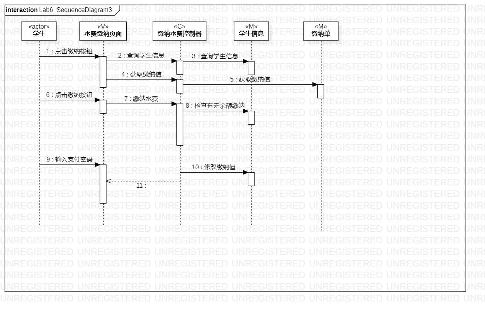

# 实验六：交互建模

## 一、实验目标  
1. 理解系统交互
2. 掌握UML顺序图的画法
3. 掌握对象交互的定义与建模方法
## 二、实验内容
1. 根据用例模型和类模型，确定功能所涉及的系统对象
2. 在顺序图上画出参与者（对象）
3. 在顺序图上画出消息（交互）
## 三、实验步骤
1. 新建类图
2. 画出各个用例用到的类
3. 用线连接各个类表示它们之间的关系
4. 将绘制的活动图导出为.jpg图片
5. 编写实验报告
6. pull本地磁盘文件和Push到自己GitHub仓库中
## 四、实验结果
   
 图1：查询水费顺序图  

   
 图2：充值余额顺序图  

   
 图3：缴纳水费顺序图