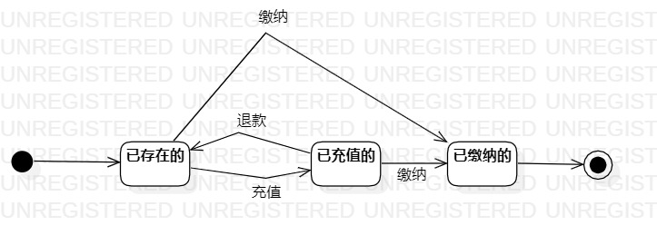

# 实验七：状态建模

## 一、实验目标  
1. 掌握对象状态建模（状态图，Statechart）。
2. 画对关键对象的状态图
## 二、实验内容
1. 找关键对象（最重要的）进行建模（不拘泥于选择的功能）；  
2. 设计状态之间的转变条件。  
## 三、实验步骤
1. 新建类图
2. 找出最关键的对象——账户余额
3. 寻找账户余额的状态图
4. 画出各个用例用到的类
5. 用线连接各个类表示它们之间的关系
6. pull本地磁盘文件和Push到自己GitHub仓库中
## 四、实验结果
   
 图1：账户的状态图