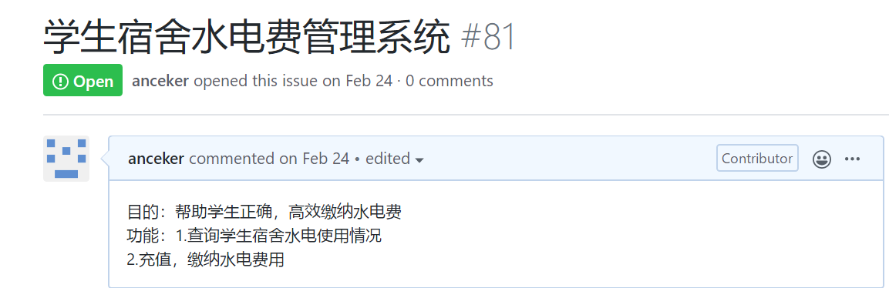

# 实验一:UML建模工具

## 实验目标
1. 工具安装之后，打开并截图，保存在实验报告中；  
2. 将个人选题及描述写在实验报告中，具体要求：
选题标题为软件名称；
描述中写出2-3个功能需求（不允许写“注册”和“登录”）；
选题功能应该包含数据库的使用。  
3. 实验报告将按照『教学助理』小程序的要求提交（此步骤延后）。

## 实验内容
1. 下载并安装建模工具 StarUML，下载地址：http://staruml.io
2. 确定个人建模选题，将选题填写在 Issues 中：
https://github.com/hzuapps/uml-modeling-20/issues

## 实验步骤
1. 安装软件Git bash  
2. 加入GITHUB库，进行克隆操作  
3. 打开StarUML,截图  
4. 撰写实验报告
5. 上传到GITHUB
6. 找到ISSUUES，确定选题

## 实验结果
  
图1：软件截屏

  
图2：学生宿舍水电费管理系统

