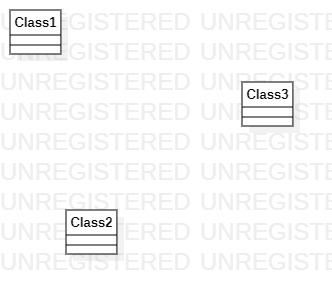

# 实验一

## 一、实验目标

1. 熟悉GitHub实验过程

2. 安装和使用StarUML

## 二、实验内容

1. 安装GitHub并练习使用Git Bash

2. 安装StarUML并创建一个图

## 三、实验步骤

1. 下载Git和StarUML

2. 在GitHub上登录账户后fork项目，clone项目到本地

3. 在StarUML建立一个图，导出

4. 用Git Bash把图片push到GitHub上

5. 在GitHub上编辑Markdown文档，插入图片

6. 使用pull request，请求合并到主库。

### 四、实验结果

图1.在StarUML上创建的第一个图
