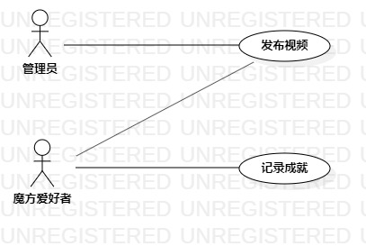

# 实验二：用例建模

## 一.实验目标
1. 熟练使用Markdown编写实验报告。

2. 确定个人建模选题。

3. 绘制用例建模图。

## 二.实验内容
1. 提交个人选题。

2. 绘制用例建模图。

3. 编写用例规约。

4. 编写实验报告。

## 三.实验步骤
1. 确定选题 #578 魔方交流系统

2. 绘制用例建模图(Use Case Diagram)

3. 确定参与者(Actor)
- 管理员
- 魔方爱好者

4. 确定用例(Use Case)
- 发布视频
- 记录成就

5. 建立参与者与用例之间的联系，完成用例建模图

6. 编写用例规约

7. 编写实验报告

## 四.实验结果

图1：魔方交流系统的用例图

## 表1：发布视频用例规约  

 用例编号  | UC01 | 备注  
-|:-|-  
用例名称  | 发布视频  |   
前置条件  |  管理员的个人页面已显示   |   
后置条件  |  系统显示视频主页面  |    
基本流程  | 1. 管理员点击发布视频按钮；  |    
~| 2. 系统读取手机相册视频；  |   
~| 3. 管理员选择视频；  |   
~| 4. 管理员点击发送按钮；  |   
~| 5. 系统检查视频规格符合要求，保存视频信息和文件;  |   
扩展流程  | 5.1 系统检查发现视频过大，无法上传视频并提示“视频过大，请重新发送”。  |   

## 表2：记录成就用例规约  

 用例编号  | UC02 | 备注  
-|:-|-  
用例名称  | 记录成就  |   
前置条件  |  魔方爱好者的个人成就页面已显示   |  
后置条件  |  系统返回个人成就页面  |    
基本流程  | 1. 魔方爱好者选择魔方类型；  | 
~| 2. 魔方爱好者输入还原魔方用时；  | 
~| 3. 魔方爱好者点击确认按钮。  |
~| 4. 系统检查所填内容不为空，保存成就；  |
扩展流程  | 4.1 系统检查发现所填内容为空，提示“输入有误，请重新输入”。  |    
