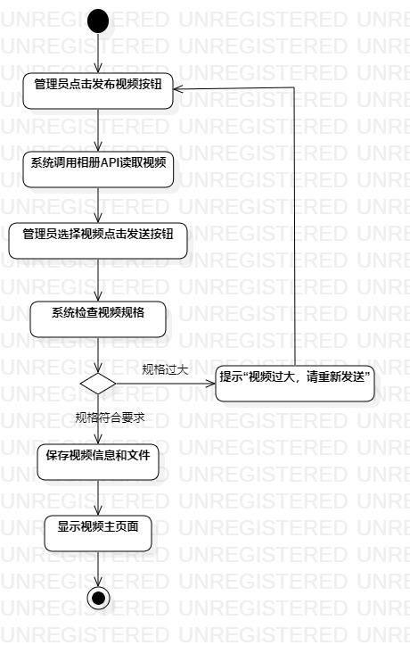
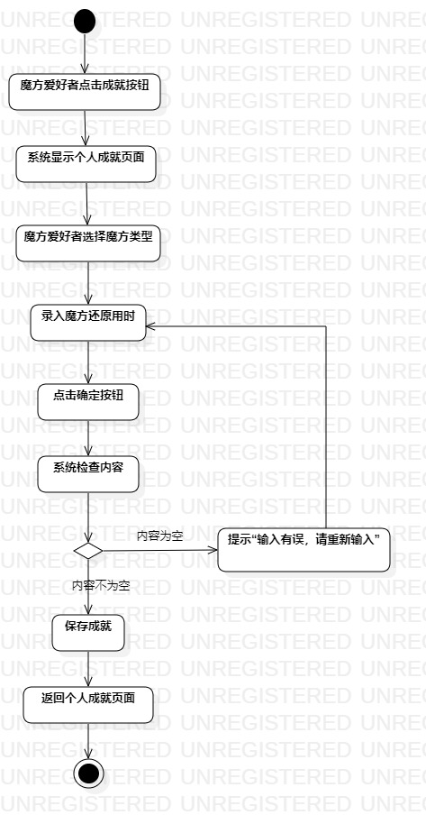

# 实验三 过程建模

## 一、实验目标

1.掌握过程建模方法。

2.掌握活动图的画法。（Activity Diagram）

## 二、实验内容

1.画出活动图（Activity Diagram）。

2.完成实验三文档。

## 三、实验步骤

1.查看实验二所写的用例规约。

2.在StarUML上作图

- 先画出开始和结束节点

- 根据用例规约画出每一步的操作，确定决策点

- 连线

3.修改实验二中的用例规约

4.提交活动图和编写实验文档

## 四、实验结果

图一：ActivityDiagram1（活动图1）

图二：ActivityDiagram2（活动图2）
