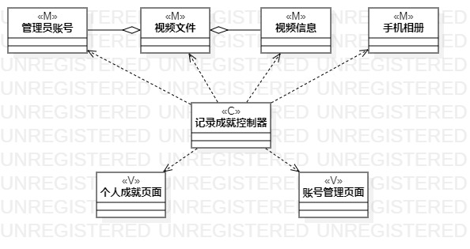
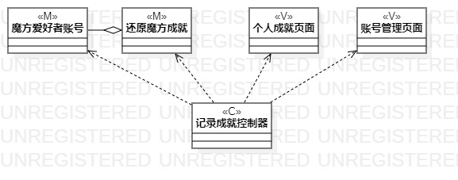

# 实验四五 类建模

## 一、实验目标

1. 掌握类建模方法；

2. 了解MVC或你熟悉的设计模式；

3. 掌握类图的画法。（Class Diagram）

## 二、实验内容

1. 基于MVC模式设计类；

2. 设计类的关系；

3. 画出类图。

## 三、实验步骤

1. 打开实验二的用例规约，从中找出类、界面和控制器；

2. 画图，画出类、界面和控制器；

3. 确定各类间的关系，连线；

4. 根据实际画图修改用例规约。

## 四、实验结果

图一：发布视频类图

图二：记录成就类图
