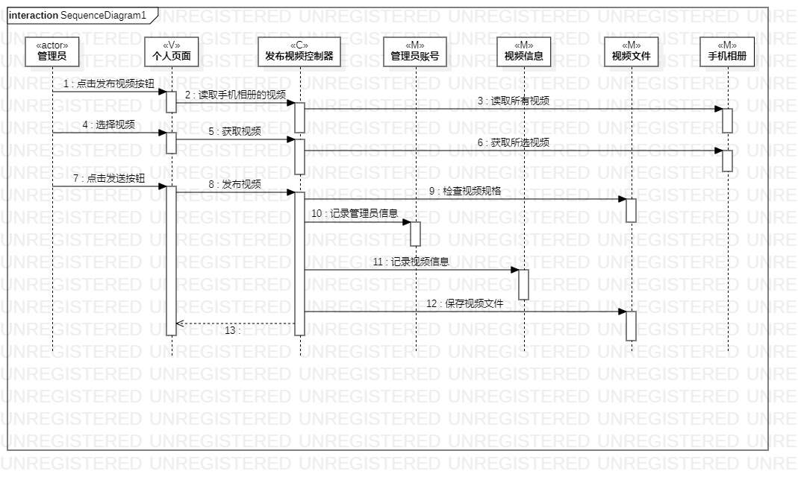
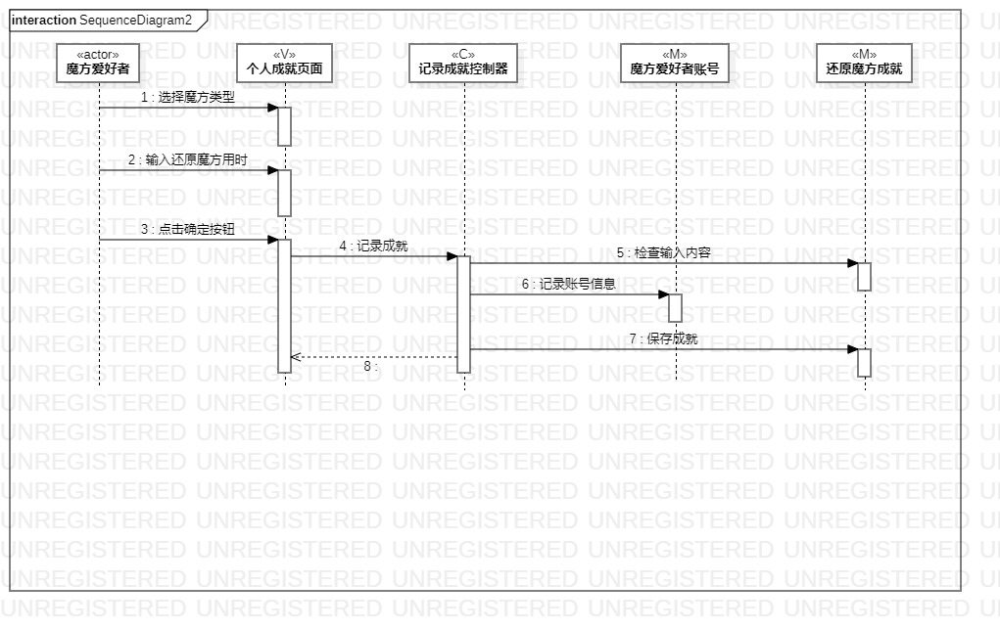

 # 实验六 交互建模
 
 ## 一、实验目标
 
 1. 理解系统交互；
 
 2. 掌握UML顺序图的画法；
 
 3. 掌握对象交互的定义与建模方法
 
 ## 二、实验内容
 
 1. 根据用例模型和类模型，确定功能所涉及的系统对象；
 
 2. 在顺序图上画出参与者（对象）；
 
 3. 在顺序图上画出消息（交互）。
 
 ## 三、实验步骤
 
 1. 查看之前所做的用例规约、活动图、类图；
 
 2. 找出系统的参与者；
 
 3. 将参与者和之前所找出的类画在顺序图中；
 
 4. 找出它们之间的关系，画出消息（交互）；
 
 5. 修改用例规约、活动图、类图。
 
 ## 四、实验结果
 
 
 
 图一：发布视频顺序图
 
 
 
 图二：记录成就顺序图
