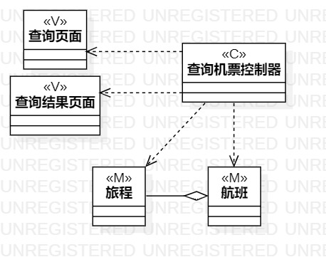
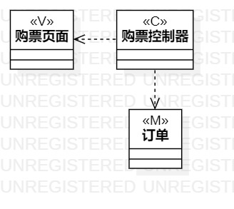

# 实验四、五   类建模、高级类建模
## 一、实验目标

1.掌握类建模方法；  
2.了解MVC或你熟悉的设计模式；  
3.掌握类图的画法。（Class Diagram）  
4.理解类的5种关系；  
5.掌握类之间关系的画法。（Class Diagram）  

## 二、实验内容

1. 观看实验4、5相关视频；
2. 用Markdown完成实验报告；
3. 用StarUML完成类、高级类建模。

## 三、实验步骤  

1.在StarUML创建两个类图：  
（1）查询机票；  
（2）购票。  
2.采取mvc模式绘制类图：  
（1）查询机票：  
M：航班；  
V：查询页面，查询结果页面；  
C：查询机票控制器。  
（2）购票：  
M：订单、机票、购票人；
V：购票页面；  
C：购票控制器。  

## 四、实验结果

  
图1 查询机票类图

  
图2 购票类图
