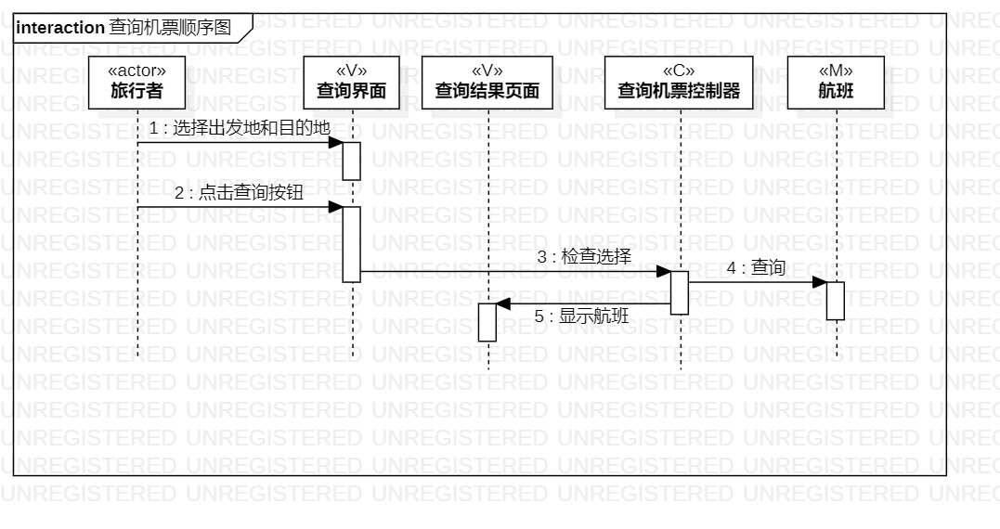
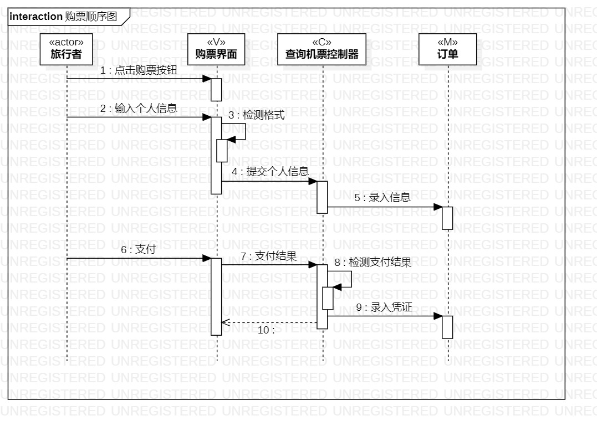

# 实验六   交互建模
## 一、实验目标

1. 理解系统交互；
2. 掌握UML顺序图的画法；
3. 掌握对象交互的定义与建模方法。

## 二、实验内容

1. 根据用例模型和类模型，确定功能所涉及的系统对象；
2. 在顺序图上画出参与者（对象）；
3. 在顺序图上画出消息（交互）。

## 三、实验步骤  

1.在StarUML创建两个顺序图：  
（1）查询机票；  
（2）购票。  
2.根据用例规约和活动图绘制顺序图。
（1）查询机票；  
参与者：旅行者；  
系统对象：查询页面、查询结果页面、查询机票控制器、航班。  
（2）购票。  
参与者：旅行者；  
系统对象：购票页面、购票控制器、订单、购票人、机票。  

## 四、实验结果

  
图1 查询机票顺序图

  
图2 购票顺序图
